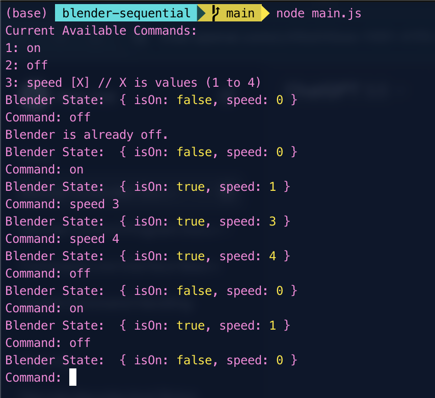

# Blender Sequential FSM

## Introduction

This program simulates a simple blender controller. It allows users to turn the blender on/off and adjust its speed.

## Requirements

- Node.js installed on your system.

## Installation

1. Clone the repository: `git clone https://github.com/your-repo/blender-controller.git`
2. Navigate to the project directory: `cd blender-controller`
3. Install dependencies: `npm install`
4. Run the program: `node index.js`

## Usage

- When you run the program, you'll see a list of available commands.
- Enter a command to interact with the blender.
- Available commands:
  1. `on` - Turns the blender on.
  2. `off` - Turns the blender off.
  3. `speed [X]` - Sets the speed of the blender. Replace `[X]` with a value from 1 to 4.

## Program Structure

- `blender_state`: Object representing the state of the blender (isOn, speed).
- `commands`: Array containing available commands.
- `displayCommands()`: Function to display available commands.
- `displayBlenderState()`: Function to display the current state of the blender.
- `validateCommand(command)`: Function to validate user input.
- Program runs in a loop until the user chooses to exit (`program_run`).

## Examples

- To turn the blender on, type `on` and press Enter.
- To set the blender speed to 3, type `speed 3` and press Enter.
- To turn the blender off, type `off` and press Enter.

## Notes

- The program validates commands to ensure they are appropriate and within range.
- Speed commands are only valid when the blender is turned on.

## License

This project is licensed under the MIT License - see the [LICENSE](LICENSE) file for details.
